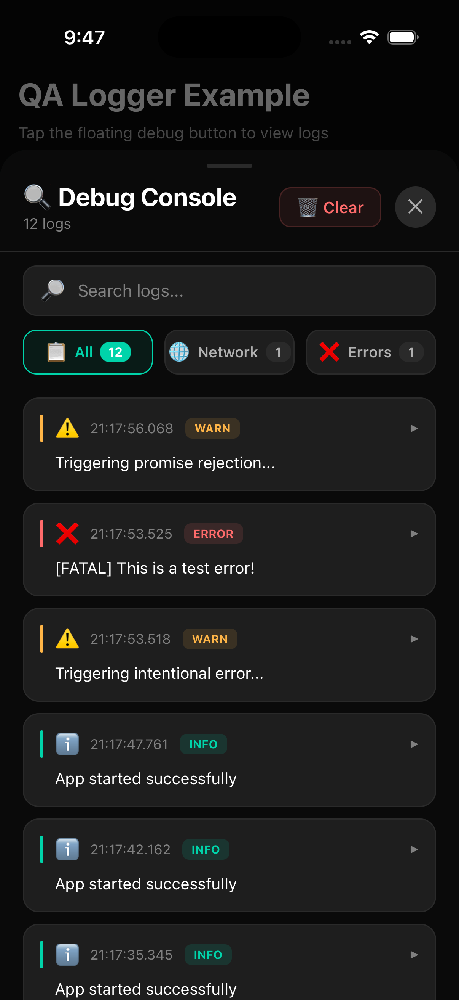

# React Native QA Logger


A powerful in-app logging and debugging package for React Native, designed specifically for QA and development builds. Inspired by Loggycian for Flutter, this package provides a comprehensive logging solution with a beautiful UI for viewing logs, network requests, and errors directly inside your app.

## Screenshot

<p align="center">
  
</p>

---

## Why react-native-qa-logger?

Debugging mobile apps is painful — logs are scattered across Metro, Logcat, Xcode and network inspectors.
QA teams struggle to reproduce issues. Developers lose time switching tools.

**react-native-qa-logger brings everything inside your app itself.**
One button. One console. All logs. All network calls. All errors.

---

## Features

* In-App Debug Console (Bottom Sheet UI)
* Floating Draggable Debug Button (snap-to-edge)
* Universal Network Logging for `fetch`, `XMLHttpRequest`, and Axios
* Global JS Error & Promise Rejection Capture
* Color Coded Logs
* Expandable Log Items
* Search & Filter (All, Network, Errors)
* Zero Production Impact (Disabled in Prod)
* Full TypeScript Support
* 100% JS – No Native Code

---

## Installation

```bash
npm install react-native-qa-logger
# or
yarn add react-native-qa-logger
```

---

## Quick Start

### Setup

```tsx
import React, { useState } from 'react';
import { SafeAreaView } from 'react-native';
import {
  logger,
  setupNetworkLogger,
  setupErrorHandlers,
  DebugButton,
  DebugConsole,
} from 'react-native-qa-logger';

setupNetworkLogger();
setupErrorHandlers();

export default function App() {
  const [visible, setVisible] = useState(false);

  return (
    <SafeAreaView style={{ flex: 1 }}>
      <DebugButton onPress={() => setVisible(true)} />
      <DebugConsole visible={visible} onClose={() => setVisible(false)} />
    </SafeAreaView>
  );
}
```

---

## Manual Logging

```ts
logger.info('User logged in', { userId: 12 });
logger.warn('Slow API', { duration: 4800 });
logger.error('Payment failed', error);
```

---

## Network Logger

Enable logging for all app network traffic:

```ts
setupNetworkLogger({
  sensitiveHeaders: ['authorization', 'x-api-key'],
  maxBodyLength: 10000,
});
```

If you use a custom Axios instance and want instance-level interceptors as well:

```ts
import axios from 'axios';
import { setupAxiosLogger } from 'react-native-qa-logger';

const apiClient = axios.create({
  baseURL: 'https://api.example.com',
});

setupAxiosLogger(apiClient, {
  sensitiveHeaders: ['authorization'],
});
```

---

## Error Capture

```ts
setupErrorHandlers();
```

Captures:

* Global JS errors
* Unhandled promise rejections
* Console errors

---

## Components

### `<DebugButton />`

Draggable floating debug button.

```tsx
<DebugButton onPress={() => setVisible(true)} />
```

---

### `<DebugConsole />`

Bottom sheet debug console.

```tsx
<DebugConsole visible={visible} onClose={() => setVisible(false)} />
```

---

## Configuration

```ts
logger.configure({ maxLogs: 500 });
```

---

## Maintainer

**Shubhanshu Barnwal**
Open-Source Author & React Native Engineer
🌐 [https://shubhanshubb.dev](https://shubhanshubb.dev)
📧 [connect@shubhanshubb.dev](mailto:connect@shubhanshubb.dev)

For feature requests, integrations, paid support, or consulting — feel free to reach out.

---

## Roadmap

* [x] Fetch API logger
* [x] XMLHttpRequest logger
* [ ] Export logs
* [ ] Share logs
* [ ] Log persistence
* [ ] Performance metrics
* [ ] Screenshot capture

---

## License

MIT

---

> Made with ❤️ by **Shubhanshu Barnwal**
> Open-Source Author of `react-native-qa-logger`
> 🌐 [https://shubhanshubb.dev](https://shubhanshubb.dev) | 📧 [connect@shubhanshubb.dev](mailto:connect@shubhanshubb.dev)

---
