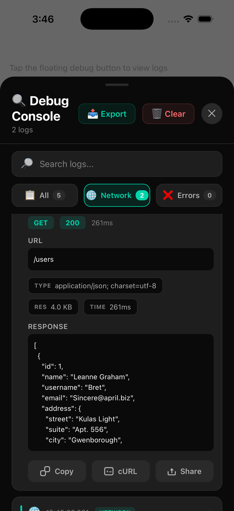

# React Native QA Logger


A powerful in-app logging and debugging package for React Native, designed specifically for QA and development builds. Inspired by Loggycian for Flutter, this package provides a comprehensive logging solution with a beautiful UI for viewing logs, network requests, and errors directly inside your app.

## Screenshots

<p align="center">
  
  &nbsp;&nbsp;
  
</p>

<p align="center">
  <em>Debug console &nbsp;·&nbsp; Network log with metadata, export, copy, cURL and share</em>
</p>

---

## Why react-native-qa-logger?

Debugging mobile apps is painful — logs are scattered across Metro, Logcat, Xcode and network inspectors.
QA teams struggle to reproduce issues. Developers lose time switching tools.

**react-native-qa-logger brings everything inside your app itself.**
One button. One console. All logs. All network calls. All errors.

---

## Features

* In-App Debug Console (Bottom Sheet UI)
* Floating Draggable Debug Button (snap-to-edge)
* Universal Network Logging for `fetch`, `XMLHttpRequest`, and Axios
* Global JS Error & Promise Rejection Capture
* Color Coded Logs
* Expandable Log Items
* Search & Filter (All, Network, Errors)
* Export logs as JSON for bug reports & QA handoff
* Copy / Share individual logs or the full console output
* Optional log persistence across app restarts
* Rich network metadata (duration, content-type, request/response size)
* Zero Production Impact (Disabled in Prod)
* Full TypeScript Support
* 100% JS – No Native Code

---

## Installation

```bash
npm install react-native-qa-logger
# or
yarn add react-native-qa-logger
```

---

## Quick Start

### Setup

```tsx
import React, { useState } from 'react';
import { SafeAreaView } from 'react-native';
import {
  logger,
  setupNetworkLogger,
  setupErrorHandlers,
  DebugButton,
  DebugConsole,
} from 'react-native-qa-logger';

setupNetworkLogger();
setupErrorHandlers();

export default function App() {
  const [visible, setVisible] = useState(false);

  return (
    <SafeAreaView style={{ flex: 1 }}>
      <DebugButton onPress={() => setVisible(true)} />
      <DebugConsole visible={visible} onClose={() => setVisible(false)} />
    </SafeAreaView>
  );
}
```

---

## Manual Logging

```ts
logger.info('User logged in', { userId: 12 });
logger.warn('Slow API', { duration: 4800 });
logger.error('Payment failed', error);
```

---

## Network Logger

Enable logging for all app network traffic:

```ts
setupNetworkLogger({
  sensitiveHeaders: ['authorization', 'x-api-key'],
  maxBodyLength: 10000,
});
```

If you use a custom Axios instance and want instance-level interceptors as well:

```ts
import axios from 'axios';
import { setupAxiosLogger } from 'react-native-qa-logger';

const apiClient = axios.create({
  baseURL: 'https://api.example.com',
});

setupAxiosLogger(apiClient, {
  sensitiveHeaders: ['authorization'],
});
```

---

## Error Capture

```ts
setupErrorHandlers();
```

Captures:

* Global JS errors
* Unhandled promise rejections
* Console errors

---

## Components

### `<DebugButton />`

Draggable floating debug button.

```tsx
<DebugButton onPress={() => setVisible(true)} />
```

---

### `<DebugConsole />`

Bottom sheet debug console.

```tsx
<DebugConsole visible={visible} onClose={() => setVisible(false)} />
```

---

## Export & Share

Export the current logs as a pretty-printed JSON string — great for attaching to a bug report or handing off to QA:

```ts
const json = logger.exportLogs();        // all logs
const errorsJson = logger.exportLogs('errors'); // only errors
```

Inside the console, tap **Export** in the header to share the visible logs via the native share sheet, or expand any log and use **Copy** / **Share** for a single entry. Expanded **network** logs also offer a **cURL** action that copies a ready-to-run `curl` command:

```ts
import { buildCurlCommand } from 'react-native-qa-logger';

// from any NetworkLogEntry
const cmd = buildCurlCommand(networkLog);
```

> Sensitive headers are redacted in the generated `curl` (shown as `[REDACTED]`), so you can safely paste it into a bug report — fill in real credentials before running.

You can also copy/share programmatically:

```ts
import { copyToClipboard, shareText } from 'react-native-qa-logger';

copyToClipboard(logger.exportLogs());
shareText(logger.exportLogs(), 'QA Logs');
```

> `copyToClipboard` uses the built-in `Clipboard` when your RN version still ships it, and otherwise falls back to the native Share sheet — no hard dependency is added. On RN 0.72+ you can enable clipboard copy by registering your installed clipboard once:
>
> ```ts
> import Clipboard from '@react-native-clipboard/clipboard';
> import { setClipboard } from 'react-native-qa-logger';
>
> setClipboard(Clipboard);
> ```

---

## Log Persistence

Persist logs across app restarts so long-running QA sessions and crash repros aren't lost. Provide any async storage adapter (e.g. AsyncStorage):

```ts
import AsyncStorage from '@react-native-async-storage/async-storage';
import { logger } from 'react-native-qa-logger';

logger.configure({
  persist: true,
  storage: AsyncStorage, // any { getItem, setItem, removeItem }
  persistKey: '@qa-logger/logs', // optional
});
```

Persisted logs are hydrated automatically on startup and cleared when you clear the console.

---

## Configuration

```ts
logger.configure({
  maxLogs: 500,
  persist: true,
  storage: AsyncStorage,
});
```

---

## Maintainer

**Shubhanshu Barnwal**
Open-Source Author & React Native Engineer
🌐 [https://shubhanshubb.dev](https://shubhanshubb.dev)
📧 [connect@shubhanshubb.dev](mailto:connect@shubhanshubb.dev)

For feature requests, integrations, paid support, or consulting — feel free to reach out.

---

## Roadmap

* [x] Fetch API logger
* [x] XMLHttpRequest logger
* [x] Export logs
* [x] Share logs
* [x] Copy request as cURL
* [x] Log persistence
* [ ] Redesigned debug console UI
* [ ] Copy as `fetch()` snippet / HAR export
* [ ] Batch "copy as cURL" for a whole session
* [ ] Opt-in raw (unredacted) cURL for local debugging
* [ ] Performance metrics
* [ ] Screenshot capture

---

## License

MIT

---

> Made with ❤️ by **Shubhanshu Barnwal**
> Open-Source Author of `react-native-qa-logger`
> 🌐 [https://shubhanshubb.dev](https://shubhanshubb.dev) | 📧 [connect@shubhanshubb.dev](mailto:connect@shubhanshubb.dev)

---
